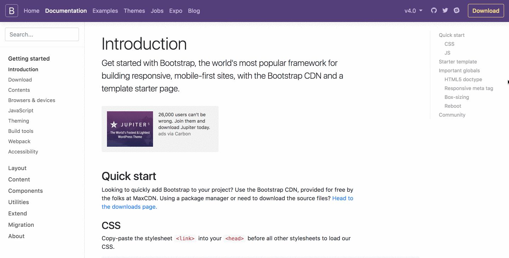
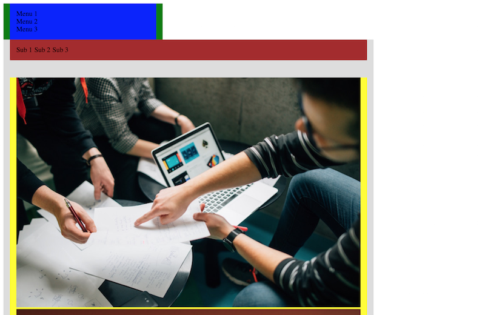
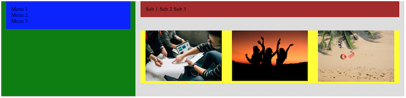
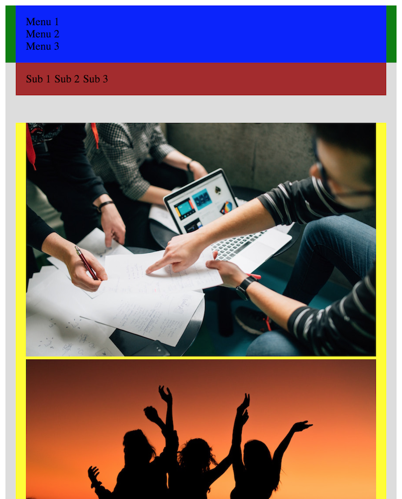
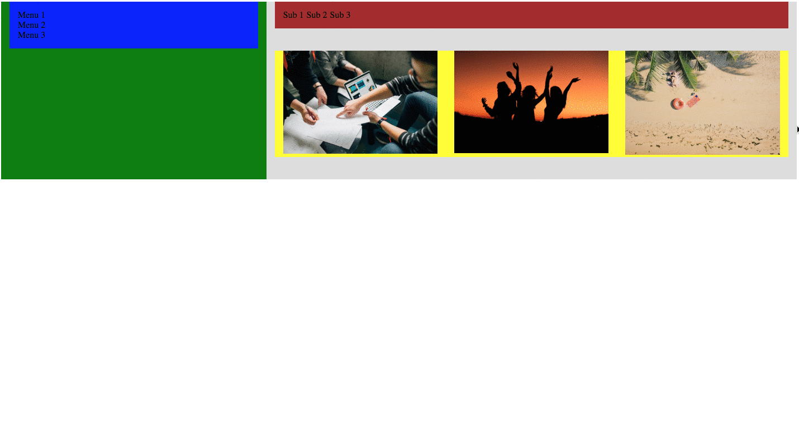

# レスポンシブデザイン

## 目的

- レスポンシブデザインの基本を学ぶ
- レスポンシブイメージの基本を学ぶ
- レスポンシブ対応のサイトを自分で作れるようになる

## レスポンシブデザインとは

元々はパソコン向けメインだったWebサイトですが、現在ではスマートフォンからのWEbへのアクセスがパソコンからのアクセスを逆転しています。また、同じスマートフォンであっても大型のものから小型のものまで多くの画面サイズの端末があり、それに加えてタブレットやゲーム機、テレビからの利用など現在のWebサイトは様々な端末からのアクセスを前提とする必要があります。こうした端末ごとにそれぞれ最適なWebサイトを提供することは可能ですが、手間を考えるとあまり現実的ではありません。そこで現在主流になっているのがレスポンシブデザインです。レスポンシブデザインは元々「A List Apart」というWebデザイナー向けのメディアで2010年に初めて紹介されました。これがあっとういう間に広がり、Googleもこの手法を推奨しています。

## レスポンシブデザインで重要な点

レスポンシブデザインにおける重要な点は以下の2つです。

- 可読性を端末ごとに最適化する
- メインで見られる情報を端末ごとに変えない

例えば下の画像は、レスポンシブデザインのためによく使われるCSSフレームワークBootstrapの例です。



このサイトの場合、以下の変化が画面サイズごとに起こっています。

#### 大きなサイズ(幅1200px以上) -> ２番目に大きなサイズ(幅768px以上)

* 右側の目次部分がなくなっています。

#### 2番目に大きなサイズ(幅768px以上) -> タブレットサイズ(幅576px以上)

* 左側のドキュメントメニューが落とされて、検索ボックスの横のハンバーガーメニュー(横線3つが並んでいるアイコン)に移動されました。
* ヘッダーメニューが１段表示から2段表示に変わっています。

#### タブレットサイズ(幅576px以上) -> モバイルサイズ(幅575px以下)

* メインコンテンツのタイトルや文章のフォントサイズが小さくなっています。

このように、画面のサイズに併せて可読性を変更しつつも、ヘッダー部分のメニュー、ドキュメントメニュー、メインコンテンツにはどの端末サイズでも同様にアクセス出来るようになっています。

## 実装の基本

この項目では、実際にレスポンシブデザインを実装する上での基本を抑えていきましょう。

### Viewportの設定

レスポンシブデザインのWebサイトを作成するには、まずheadのmeta Viewportタグを設定する必要があります。基本的に下記のように設定します。

```html
<head>
  <meta name="viewport" content="width=device-width, initial-scale=1">
  ...
</head>
```

`width=device-width`は、サイトの幅を端末の幅一杯に表示することを意味します。`initial-scale=1`と設定することで例えばスマートフォンの向きが表示が縦から横に変わった際に、自動的に幅の変更を認識してサイトの表示を変えることが出来ます。`initial-scale=1`を適用しない場合一部のブラウザでは、縦の表示のサイトが拡大されて表示されることがあるので必ず上記のように指定しましょう。

### CSSメディアクエリを利用する

CSSのメディアクエリというフィルターを利用すると、画面サイズに応じて異なるCSSを適用することが簡単に出来ます。

基本的な書き方は以下の通りです。

```css
@media (クエリ) {
  /* クエリと画面サイズが合致する時に適用したいCSSルール */
}
```

例えば、Bootstrapの例のように画面サイズが変更された際に右側のメニューを表示しないようにしたければ以下のように書くことが出来ます。

```html
<div class="right-menu">
  ...
</div>
```
```css
.right-menu {
  /* ビューポートサイズが1200px未満のときには何も表示しない */
  display: none;
}

@media (min-width: 1200px) {
  .right-menu {
    display: block;
  }
}
```
#### クエリの書き方

上記の例で`(min-width: 1200px)`の部分をクエリと呼びます。クエリには問合せという意味があり、ビューポートがこのクエリに合致するか問合せし、合致するならそれ以下のCSSを適用します。min-widthを含めてよく使われるのが以下のクエリです。

- min-width - ブラウザの幅がここで定義された値より大きい場合にルールを適用する
- max-width - ブラウザの幅がここで定義された値より小さい場合にルールを適用する
- min-height - ブラウザの高さがここで定義された値より大きい場合にルールを適用
- max-height - ブラウザの高さがここで定義された値より小さい場合にルールを適用する

#### モバイルファーストデザイン

最近では、モバイルからのアクセスがPCからのアクセスより多いサイトが多くなってきました。モバイルの場合、表示領域が小さいため一度に見られる情報が限られてきます。多くの情報を見るためにはスクロールを大量にしなければならず大変です。このことから、生まれたのがパソコン用サイトのように大量の情報が見られる状態を基準にするのではなく、モバイル向けにサイトを最適化しようというモバイルファーストの考え方です。

例えば、Bootstrapの右側メニューを隠す際のCSSの例は以下のように書き換えることが出来ます。

```css
.right-menu {
  display: block
}

@media (max-width: 1199px) {
  .right-menu: {
    display: none;
  }
}
```

この例では、通常時は`display: block;`を適用しますが、横幅が1199pxまでは表示しないという設定をしています。メディアクエリの部分はオプションとして見ると、パソコンサイトじゃないものはオプションとして捉えていると見ることが出来ます。対して、最初の例では通常時は`display: none;`を適用するけど、横幅が1200pxならオプション的に表示するという意味合いがあります。このようにパソコンのような大きな画面からのアクセスを基準にする際は`max-width`を利用し、モバイルからのアクセスが多いサイトなら`min-width`を適用するようにしましょう。

#### メディアクエリ利用時の注意点

CSSファイルは上から順番に適用されていき、同じセレクタ、属性へのルールがある場合、上にあるルールは下にあるルールに上書きされてしまいます。そのためメディアクエリを利用したCSSルールの順番も非常に重要です。例えば、以下のCSSは上手く適用されません。

```css
@media (min-width: 1200px) {
  .right-menu {
    display: block;
  }
}
.right-menu {
  /* ビューポートサイズが1200px未満のときには何も表示しない */
  display: none;
}
```

なぜかというと、1200px以上の画面サイズで`display:block`が適用されるはずの場合でも、そのCSSルールの直後に`display:none`が設定されており、こちらが最終的に適用されるためです。

2つ以上のメディアクエリを書く時は以下のようにします。

```css
.right-menu {
  /* ビューポートサイズが1200px未満のときには何も表示しない */
  display: none;
}

@media (min-width: 769px) {
  .right-menu {
    display: inline-block;
  }
}
@media (min-width: 1200px) {
  .right-menu {
    display: block;
  }
}
```

このようにすれば、768px未満なら`display:none`が適用され、769px以上、1200px未満の場合は`inline-block`が適用され、1200px以上であれば`block`が適用されます。

もう一つの書き方として、`and`を使ってより細かく条件を指定することも可能です。その場合上記の例は以下のように書き換えることが出来ます。

```css
.right-menu {
  /* ビューポートサイズが1200px未満のときには何も表示しない */
  display: none;
}

@media (min-width: 1200px) {
  .right-menu {
    display: block;
  }
}

@media (min-width: 769px) and (max-width: 1199px) {
  .right-menu {
    display: inline-block;
  }
}
```

### ブレークポイント

レスポンシブデザインにおいて、異なるCSSを適用したいときの幅や高さをブレークポイントと呼びます。例えばBootstrapの例であれば**1200px**がブレークポイントの一つとなっています。このブレークポイントはサイトのページごとや部分ごとに適用して良いのですが最も簡単なのはサイト全体で一貫したブレークポイントを利用することです。例えば、以下はBootstrapの例です。

- モバイル向け - 575px以下
- 大きめモバイル向け(ファブレット) - 576px以上769px未満
- タブレット向け - 769px以上992px未満
- パソコン向け - 992px以上1200px未満
- より大きなサイズのパソコン向け - 1200px以上

こうした一貫したブレークポイントのことを**メジャーブレークポイント**とGoogleは読んでいます。加えてサイトの一部分だけに適用するブレークポイントのことを**マイナーブレークポイント**と呼びます。


### 今後の動き

以前はファブレットが主流ではなかったため、ブレークポイントは3つというサイトが主流でした。それがファブレットが増えるにつれて4つのブレークポイントを使うようになっています。このようにブレークポイントの決め方は一様ではなく端末の流行り廃り、進化によって変わっていきます。

例えばですが、2016年11月にGoogleがモバイルファーストインデックスを採用し、パソコン版とモバイル版の検索順位を変更するという発表を行いました。

[モバイル ファースト インデックスに向けて](https://webmaster-ja.googleblog.com/2016/11/mobile-first-indexing.html)

これに伴って、これまでモバイルからパソコンまで全てに対応するレスポンシブデザインを行っていた大手のサイトで、モバイル専用のサイトと、タブレットからパソコンに対応するレスポンシブデザインサイトの2つを作るという動きが出ています。

このように、業界の流れを追いながらデザイン手法を変えていくのが重要です。

## レスポンシブイメージ

レスポンシブウェブデザインを実践する上で重要なのがイメージの扱いです。

例えばですが、以下のように設定すると何が起こるでしょうか？

```css
.some-image {
  width: 800px;
}
```

この場合、画像以外の部分をレスポンシブ対応にしていたとしても、画像の大きさは常に800pxのため画面サイズが小さくなった時に画像が外にはみ出してしまいます。
そのため、画像には決まったサイズではなく`%`を利用します。

```css
.some-image {
  width: 100%;
  max-width: 100%;
}
```

レスポンシブイメージの領域はこれだけではなく、`srcset`要素を利用して異なる解像度の端末に対応する方法や、`picture`要素を利用して縦長表示の場合は、画像中心部分だけを表示する方法などがあります。ただ、この2つの要素は一部の主要ブラウザでまだ対応が遅れているため今回のレッスンでは解説をしません。興味のある方は是非「更に学ぼう」のリンク先をご覧下さい。


## グリッドレイアウトをレスポンシブ対応する

前回のレッスンでは、グリッドレイアウトを利用したレイアウト方法について学びました。この項目ではこのグリッドレイアウトをブレークポイントに併せて変更するにはどうすればいいのか基本を学びます。今回は単純化のために3つのグリッドで、ブレークポイントを`600px`の一つだけのサイトを作ってみましょう。


### 1. containerとモバイル版のグリッドを組む

前回のレッスンの例で作成したグリッドを少し変更したものが以下です。前回のレッスンでは`.container`内に横並びにするための`display:flex`を一緒に含めていたのですが、今回はグリッドレイアウトにしたくない部分にはflexを適用しなくても良いように`.row`というセレクタを作成しています。また、.containerで`padding:15px`が設定されているのですが、これがリセットされるように`.row`内で`margin: 0 -15px`を定義しています。

```css
/* Base */
* {
  box-sizing: border-box;
  margin: 0;
  padding: 0;
}

ul {
  list-style: none;
}
ul, li {
  margin: 0;
  padding: 0;
  border: 0;
  font: inherit;
  vertical-align: baseline;
}

/* Grid */
.container {
  width: 100%;
  padding: 0 15px;
  margin: 0 auto;
}

.row {
  display: flex;
  margin: 0 -15px; /* グリッドを使わないコンテンツとグリッドを使うコンテンツとの位置を調整 */
}

.col-1 {
  width: 33.33%;
}

.col-2 {
  width: 66.67%;
}

.col-3 {
  width: 100%;
}

.col-1, col-2, .col-3 {
  padding: 0 15px;
}
```

### 2. ブレークポイントごとにグリッドを組む

一つの手法としては、服のサイズのように画面のサイズをX-SMALL(xs)、SMALL(sm)、Medium(md)、LARGE(lg)と分ける方法です。
今回はブレークポイントが`600px`の1つだけなので`col-数値`と`col-lg-数値`の2つだけを定義していきます。

```css
/* Grid */
.container {
  width: 100%;
  padding: 0 15px;
  margin: 0 auto;
}

.row {
  display: flex;
  margin: 0 -15px;  /* グリッドを使わないコンテンツとグリッドを使うコンテンツとの位置を調整 */
}

.col-1 {
  flex-basis: 33.33%;
}

.col-2 {
  flex-basis: 66.67%;
}

.col-3 {
  flex-basis: 100%;
}

@media (min-width: 600px) {
  .col-lg-1 {
    flex-basis: 33.33%
  }
  .col-lg-2 {
    flex-basis: 66.67%;
  }
  .col-lg-3 {
    flex-basis: 100%;
  }
}

.col-1, .col-2, .col-3, .col-lg-1, .col-lg-2, .col-lg-3 {
  padding: 0 15px;
}
```

上記のように、`@media (min-width: 600px)`以下で、600px以上の画面サイズの時用のCSSスタイルを定義しています。

### 3. HTMLで構成を表現する。

コンテンツの構成をHTMLで書きます。

```html
<!DOCTYPE html>
<html>
  <link rel="stylesheet" href="./styles.css"/>
<head>
</head>
<body>
  <div class=container>
    <div class="row">
      <div class="main-menu-wrapper col-3 col-lg-1">
        <ul class="main-menu">
          <li>Menu 1</li>
          <li>Menu 2</li>
          <li>Menu 3</li>
        </ul>
      </div>
      <main class="main-wrapper col-3 col-lg-2">
        <header>
          <div class="flex-container sec-menu-wrapper">
            <div class="sec-menu">
              <div class="sec-menu-item">Sub 1</div>
              <div class="sec-menu-item">Sub 2</div>
              <div class="sec-menu-item">Sub 3</div>
            </div>
          </div>
        </header>
        <div class="main-content">
          <div class="container">
            <div class="row images">
              <div class="col-3 col-lg-1">
                
              </div>
              <div class="col-3 ol-lg-1">
                
              </div>
              <div class="col-3 col-lg-1">
                
              </div>
            </div>
          </div>
        </div>
      </div>
    </main>
  </div>
</body>
```

上記で注目頂きたいのが、`class="col-3 col-lg-1"`というような属性の値の書き方です。このように書くことで幅が600px未満の時は**col-3**が利用され、600px以上なら、**col-lg-1**の定義が有効となるため、こちらが利用されます。
また上記の例では`Container`のネストも行っています。このようにグリッドレイアウトの中に更にグリッドを組むことで複雑なレイアウトも表現出来ます。

### 4 画像をレスポンシブ対応にする

さて、上記のHTMLとCSSを利用した実際のサイトを見てみましょう。



上手く表示されてないですね。これはなぜかというと、上記で述べたレスポンシブイメージの設定がまだされてないからです。そこで以下を追加します。

```css
img {
  max-width: 100%;
}
```

すると、以下のように表示が修正されました。



[サンプルコード](https://github.com/codegrit-jp-students/codegrit-html-css-lesson08-samples/tree/master/responsive-image)

### 5. `flex-wrap: wrap`を設定する

さて、次に600px未満の横幅でもちゃんと見られるかどうか試してみましょう。


上手く表示されません。これはなぜかというと、`flex-wrap`が設定されておらずデフォルトの値である`flex-wrap: nowrap`が適用されているからです。

そこで、`.row`セレクタに`flex-wrap: wrap`を追加しましょう。



無事に表示することが出来ました。



[サンプルコード](https://github.com/codegrit-jp-students/codegrit-html-css-lesson08-samples/tree/master/flex-wrap)

## チャレンジ

[チャレンジ8](./challenge/README.md)

## 更に学ぼう

### 記事で学ぶ

- [レスポンシブウェブデザインの基本](https://developers.google.com/web/fundamentals/design-and-ux/responsive/?hl=ja)
- [レスポンシブイメージ](https://developers.google.com/web/fundamentals/design-and-ux/responsive/images?hl=ja)
- [Responsive Images - MDN](https://developer.mozilla.org/en-US/docs/Learn/HTML/Multimedia_and_embedding/Responsive_images)
- [Responsive Web Design - A List Apart](https://alistapart.com/article/responsive-web-design)

### 動画で学ぶ

- [レスポンシブウェブデザイン入門 - ドットインストール](https://dotinstall.com/lessons/basic_responsivewebdesign)
