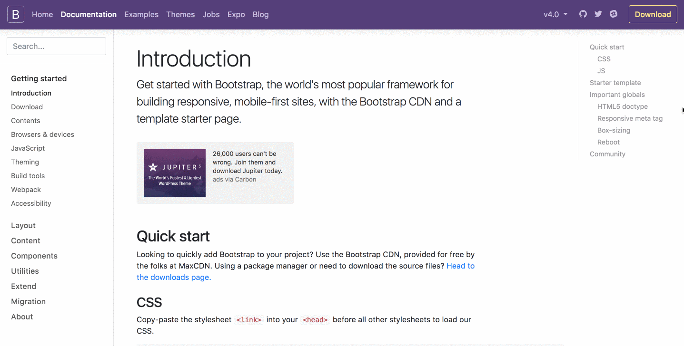

## レスポンシブデザインとは

元々はパソコン向けメインだったWebサイトですが、現在ではスマートフォンからのWebへのアクセスがパソコンからのアクセスを逆転しています。また、同じスマートフォンであっても大型のものから小型のものまで多くの画面サイズの端末があり、それに加えてタブレットやゲーム機、テレビからの利用など現在のWebサイトは様々な端末からのアクセスを前提とする必要があります。こうした端末ごとにそれぞれ最適なWebサイトを提供することは可能ですが、手間を考えるとあまり現実的ではありません。そこで現在主流になっているのがレスポンシブデザインです。レスポンシブデザインは元々「A List Apart」というWebデザイナー向けのメディアで2010年に初めて紹介されました。これがあっとういう間に広がり、Googleもこの手法を推奨しています。

## レスポンシブデザインで重要な点

レスポンシブデザインにおける重要な点は以下の2つです。

- レイアウトを端末の幅ごとに最適化する
- メインで見られる情報を端末ごとに変えない

例えば下の画像は、レスポンシブデザインのためによく使われるCSSフレームワークBootstrapの例です。

このサイトの場合、以下の変化が画面サイズごとに起こっています。

### 大きなサイズ(幅1200px以上) -> ２番目に大きなサイズ(幅768px以上)

* 右側の目次部分がなくなっています。

### 2番目に大きなサイズ(幅768px以上) -> タブレットサイズ(幅576px以上)

* 左側のドキュメントメニューが落とされて、検索ボックスの横のハンバーガーメニュー(横線3つが並んでいるアイコン)に移動されました。
* ヘッダーメニューが１段表示から2段表示に変わっています。

### タブレットサイズ(幅576px以上) -> モバイルサイズ(幅575px以下)

* メインコンテンツのタイトルや文章のフォントサイズが小さくなっています。

このように、画面のサイズに併せて可読性を変更しつつも、ヘッダー部分のメニュー、ドキュメントメニュー、メインコンテンツにはどの端末サイズでも同様にアクセス出来るようになっています。