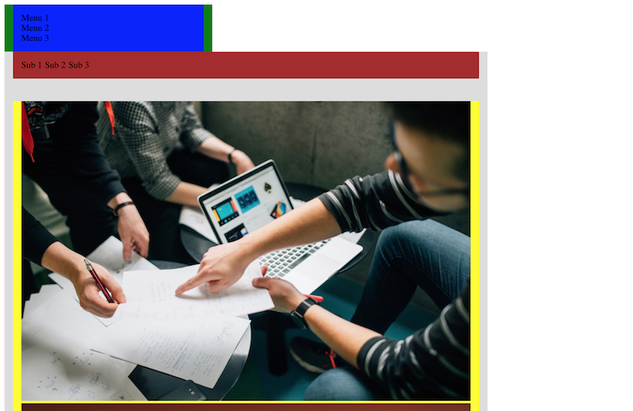
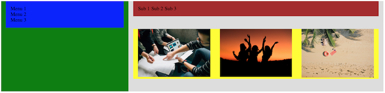
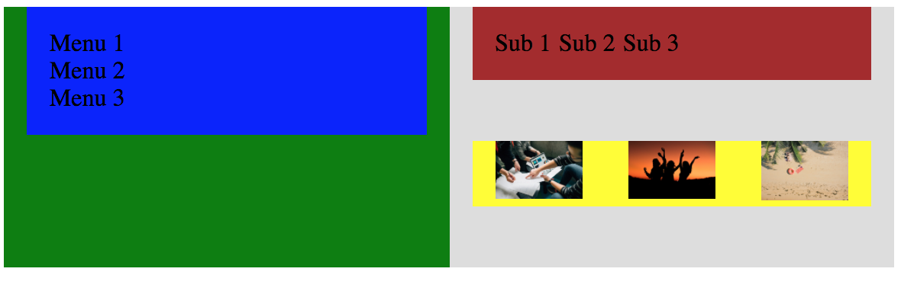
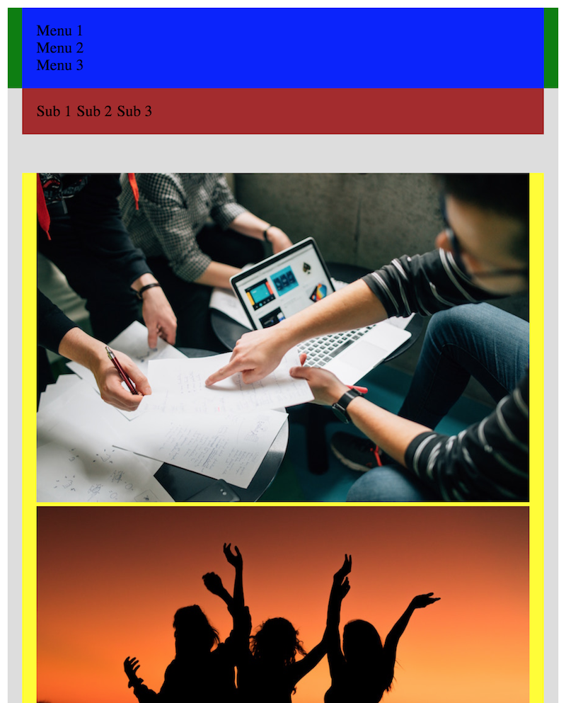
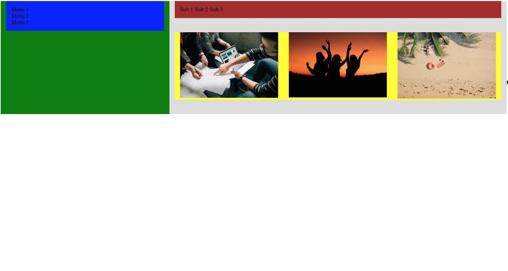

## グリッドレイアウトをレスポンシブ対応する

前回のレッスンでは、グリッドレイアウトを利用したレイアウト方法について学びました。この項目ではこのグリッドレイアウトをブレークポイントに併せて変更するにはどうすればいいのか基本を学びます。今回は単純化のために3つのグリッドで、ブレークポイントを`600px`の一つだけのサイトを作ってみましょう。


### 1. containerとモバイル版のグリッドを組む

前回のレッスンの例で作成したグリッドを少し変更したものが以下です。今回はガーターの幅を`20px`ではなく`30px`に設定しています。また簡単にするため12のカラムに分けるのではなく3つのコラムに分けています。

```css
/* Base */
* {
  box-sizing: border-box;
  margin: 0;
  padding: 0;
}

ul {
  list-style: none;
}

ul, li {
  margin: 0;
  padding: 0;
  border: 0;
  font: inherit;
  vertical-align: baseline;
}

/* Grid */
.container {
  width: 100%;
  padding: 0 15px;
  margin: 0 auto;
}

.row {
  display: flex;
  margin: 0 -15px; /* グリッドを使わないコンテンツとグリッドを使うコンテンツとの位置を調整 */
}

.col-1 {
  width: 33.33%;
}

.col-2 {
  width: 66.67%;
}

.col-3 {
  width: 100%;
}

.col-1, col-2, .col-3 {
  padding: 0 15px;
}
```

### 2. ブレークポイントごとにグリッドを組む

一つの手法としては、服のサイズのように画面のサイズをX-SMALL(xs)、SMALL(sm)、Medium(md)、LARGE(lg)と分ける方法です。
今回はブレークポイントが`600px`の1つだけなので`col-数値`と`col-lg-数値`の2つだけを定義していきます。

```css
/* Grid */
.container {
  width: 100%;
  padding: 0 15px;
  margin: 0 auto;
}

.row {
  display: flex;
  margin: 0 -15px;  /* グリッドを使わないコンテンツとグリッドを使うコンテンツとの位置を調整 */
}

.col-1 {
  flex-basis: 33.33%;
}

.col-2 {
  flex-basis: 66.67%;
}

.col-3 {
  flex-basis: 100%;
}

@media (min-width: 600px) {
  .col-lg-1 {
    flex-basis: 33.33%
  }
  .col-lg-2 {
    flex-basis: 66.67%;
  }
  .col-lg-3 {
    flex-basis: 100%;
  }
}

.col-1, .col-2, .col-3, .col-lg-1, .col-lg-2, .col-lg-3 {
  padding: 0 15px;
}
```

上記のように、`@media (min-width: 600px)`以下で、600px以上の画面サイズの時用のCSSスタイルを定義しています。

### 3. HTMLで構成を表現する。

コンテンツの構成をHTMLで書きます。

```html
<!DOCTYPE html>
<html>
  <link rel="stylesheet" href="./styles.css"/>
<head>
</head>
<body>
  <div class=container>
    <div class="row">
      <div class="main-menu-wrapper col-3 col-lg-1">
        <ul class="main-menu">
          <li>Menu 1</li>
          <li>Menu 2</li>
          <li>Menu 3</li>
        </ul>
      </div>
      <main class="main-wrapper col-3 col-lg-2">
        <header>
          <div class="flex-container sec-menu-wrapper">
            <div class="sec-menu">
              <div class="sec-menu-item">Sub 1</div>
              <div class="sec-menu-item">Sub 2</div>
              <div class="sec-menu-item">Sub 3</div>
            </div>
          </div>
        </header>
        <div class="main-content">
          <div class="container">
            <div class="row images">
              <div class="col-3 col-lg-1">
                
              </div>
              <div class="col-3 ol-lg-1">
                
              </div>
              <div class="col-3 col-lg-1">
                
              </div>
            </div>
          </div>
        </div>
      </div>
    </main>
  </div>
</body>
```

上記で注目頂きたいのが、`class="col-3 col-lg-1"`というような属性の値の書き方です。このように書くことで幅が600px未満の時は**col-3**が利用され、600px以上なら、**col-lg-1**の定義が有効となるため、こちらが利用されます。
また上記の例では`Container`のネストも行っています。このようにグリッドレイアウトの中に更にグリッドを組むことで複雑なレイアウトも表現出来ます。

### 4 画像をレスポンシブ対応にする

さて、上記のHTMLとCSSを利用した実際のサイトを見てみましょう。



上手く表示されてないですね。これはなぜかというと、上記で述べたレスポンシブイメージの設定がまだされてないからです。そこで以下を追加します。

```css
img {
  width: 100%;
  max-width: 100%;
}
```

すると、以下のように表示が修正されました。



[サンプルコード](https://github.com/codegrit-jp-students/codegrit-html-css-lesson08-samples/tree/master/responsive-image)

### 5. `flex-wrap: wrap`を設定する

さて、次に600px未満の横幅でもちゃんと見られるかどうか試してみましょう。



上手く表示されません。これはなぜかというと、`flex-wrap`が設定されておらずデフォルトの値である`flex-wrap: nowrap`が適用されているからです。

そこで、`.row`セレクタに`flex-wrap: wrap`を追加しましょう。



無事に表示することが出来ました。



[サンプルコード](https://github.com/codegrit-jp-students/codegrit-html-css-lesson08-samples/tree/master/flex-wrap)

## 更に学ぼう

### 記事で学ぶ

- [レスポンシブウェブデザインの基本](https://developers.google.com/web/fundamentals/design-and-ux/responsive/?hl=ja)
- [レスポンシブイメージ](https://developers.google.com/web/fundamentals/design-and-ux/responsive/images?hl=ja)
- [Responsive Images - MDN](https://developer.mozilla.org/en-US/docs/Learn/HTML/Multimedia_and_embedding/Responsive_images)
- [Responsive Web Design - A List Apart](https://alistapart.com/article/responsive-web-design)

### 動画で学ぶ

- [レスポンシブウェブデザイン入門 - ドットインストール](https://dotinstall.com/lessons/basic_responsivewebdesign)
